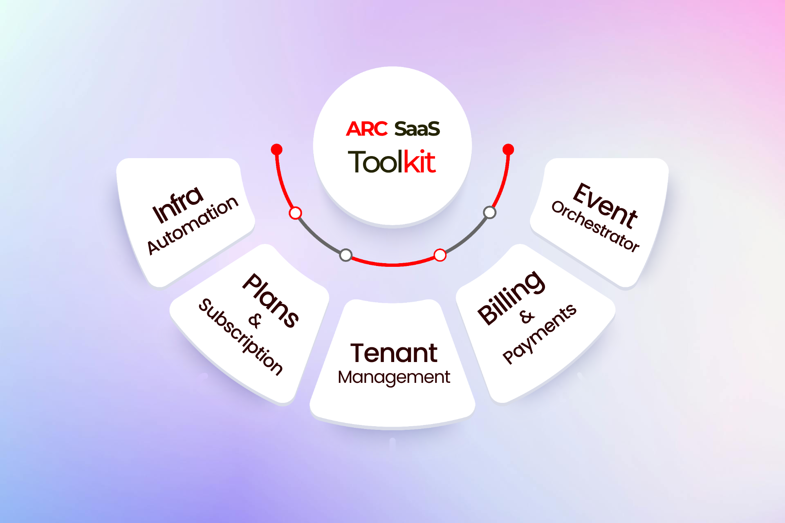

  

  With ARC SaaS, we’re introducing a pioneering SaaS factory model based control plane microservices and IaC modules that promises to revolutionize your SaaS journey.

<!--  -->
<!-- Will add once we publish this -->

# ARC SaaS - Accelerating SaaS Application Development

ARC SaaS is an open source control plane accelerator that provides a solid foundation for building and managing multi-tenant SaaS applications. It implements the patterns, principles, and best practices laid out by the AWS SaaS Builder Toolkit, empowering SaaS providers to focus on their core business while leaving the heavy lifting of the technological foundation to ARC SaaS.

## Features

- **Tenant Onboarding and Provisioning**: Streamline the tenant onboarding process with guided setup, personalized support, and seamless rollout of new tenants.
- **Tenant Isolation**: Ensure secure separation of each tenant's data, workflows, and configurations with robust access controls and data isolation.
- **Tenant Management**: Centrally manage all tenants, including new releases, feature flagging, plan upgrades, and more.
- **Customizable Plans**: Manage and configure tailored licensing plans based on isolation models, sizing, and feature parity.
- **Tenant Observability and Analytics**: Monitor resource health, utilization, and performance at the tenant level for data-driven decision making.

## Why ARC SaaS

Our control plane, akin to [our catalog of application plane services](https://github.com/sourcefuse/loopback4-microservice-catalog), provides a range of advantages. ARC SaaS not only accelerates SaaS application development but also offers customization tailored to your needs, granting you the flexibility to harness the full spectrum of ARC benefits. This includes time-saving measures, adherence to best practices, seamless plug-and-play integration, and a standardized approach based off AWS SaaS factory reference architecture principles. All of this following the SaaS standards and architecture that accommodates your unique requirements.

ARC SaaS architecture consists of two major layers at a high level

- Control Plane - The control plane is foundational to any multi-tenant SaaS model. ARC SaaS control plane include the services that give consumers the ability to manage and operate their tenants through a single, unified experience. Within the control plane, we have 3-tier architecture supporting UI (or some CLI), API and data separately. The core services here represent the collection of services that are used to orchestrate multi-tenant experience. We’ve included some of the common examples of services that are typically part of the core. However, these core services could vary for each SaaS solution depending on the requirements. In the architecture diagram above, we have also shown a separate administration application UI. This represents the application (a web application, a command line interface, or an API) that might be used by a SaaS provider to manage their multi-tenant environment. Please note that the control plane and its services are not actually multi-tenant. These services are global to all tenants and are basically used to operate and manage tenants.

- Application Plane - This plane of a SaaS environment is your actual Application that the end-users will consume. This is where the multi-tenant functionality of the actual application will reside.

This repo covers the control plane of Saas model.

## What we offer

Control plane will be the power house of your SaaS application. With the help of this control plane all your tenant applications can be managed and monitored effortlessly. This control plane ensures a smooth and efficient tenant onboarding.

## Logical Architecture

## API Flow Diagram

## Pre-built Micro-services

There are currently 2 Microservices provided and actively maintained:

1. [Tenant Management Service](services/tenant-management-service)
2. [Subscription Service](services/subscription-service)
3. [Orchestrator Service](services/orchestrator-service/README.md)

## Architecture Overview

ARC SaaS provides a control plane that manages and orchestrates the overall operation of the SaaS product on AWS EKS. The control plane includes components and services for configuration, monitoring, scaling, security, and IaC modules written in Terraform.

The core services represent the collection of services used to orchestrate the multi-tenant experience, while the application plane is where the actual business logic and product services reside.

## Customization and Support

Each SaaS application is unique, and you may need to customize ARC SaaS to fit your specific requirements. SourceFuse's SaaS and AWS cloud experts can help you tailor ARC SaaS for your needs and extend it to your application and deployment architecture.

## About SourceFuse

SourceFuse is a AWS Premier Partner leading provider of SaaS solutions and services. With over a decade of experience in building SaaS apps and platforms, SourceFuse is committed to empowering SaaS companies and traditional ISVs to focus on their core business while providing a solid technological foundation.

For more information about how SourceFuse can help you on your SaaS journey, please visit our website or contact us directly.

## Feedback

If you've noticed a bug or have a question or have a feature request, [search the issue tracker](https://github.com/sourcefuse/arc-saas/issues) to see if someone else in the community has already created a ticket.
If not, go ahead and [make one](https://github.com/sourcefuse/arc-saas/issues/new/choose)!
All feature requests are welcome. Implementation time may vary. Feel free to contribute the same, if you can.
If you think this extension is useful, please [star](https://help.github.com/en/articles/about-stars) it. Appreciation really helps in keeping this project alive.

## Contributing

Please read [CONTRIBUTING.md](https://github.com/sourcefuse/arc-saas/blob/master/.github/CONTRIBUTING.md) for details on the process for submitting pull requests to us.

## Code of conduct

Code of conduct guidelines [here](https://github.com/sourcefuse/arc-saas/blob/master/.github/CODE_OF_CONDUCT.md).

## License

ARC SaaS is released under the [MIT](https://github.com/sourcefuse/arc-saas/blob/master/LICENSE) License.
