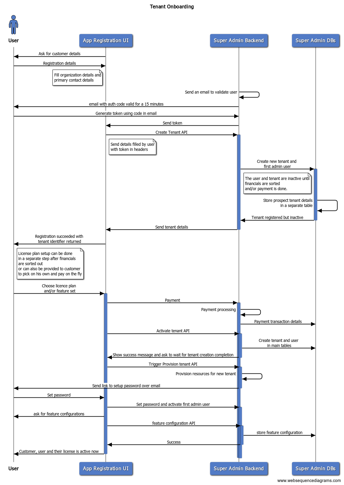

# tenant-mgmt-facade

This is the primary facade of the control plane responsible for working with the `tenant-mgmt-service` and `subscription-service` to facilitate the tenant onboarding process

## Prerequisites

- Postgresql 16+
- Redis 7+
- node 16+
- npm 8+

## Setup

- install all the required packages using `npm i`
- create an `.env` file with all the required properties. Refer the [`.env.example`](./.env.example) for required env variables
- run the service using `npm start`

## Onboarding a tenant

- The onboarding process starts through a concept of a `Lead`. A `Lead` is a prospective client who may or may not end being a tenant in our system. Refer the [`tenant-mgmt-service`](../../services/tenant-mgmt-service/README.md) for more details.
- The overall flow is supposed to be something like this -

- The `Lead` is created through POST `/leads` endpoint, which creates a Lead and sends an email to verify the email address of the lead
- The mail has a link which should direct to a front end application, which in turn would call the upcoming api's using a temporary authorization code included in the mail.
- The front end application first calls the `/leads/{id}/verify` which updates the validated status of the lead in the DB and returns a new JWT Token that can be used for subsequent calls
- If the token is validated in the previous step, the UI should call the `/leads/{id}/tenants` endpoint with the necessary payload(as per swagger documentation).
- This endpoint would onboard the tenant in the DB, and the facade is then supposed to trigger the relevant pipeline using the `/tenants/{id}/provision` endpoint by fetching the details of the plan from the subscription-service's GET `/plans` endpoint.
- This endpoint also creats a subscription in the subscription-service with `startDate` being the current date and end date being calculated based on the duration of the plan selected.
- It also creates an `Invoice` for this period using the `tenant-mgmt-service`
