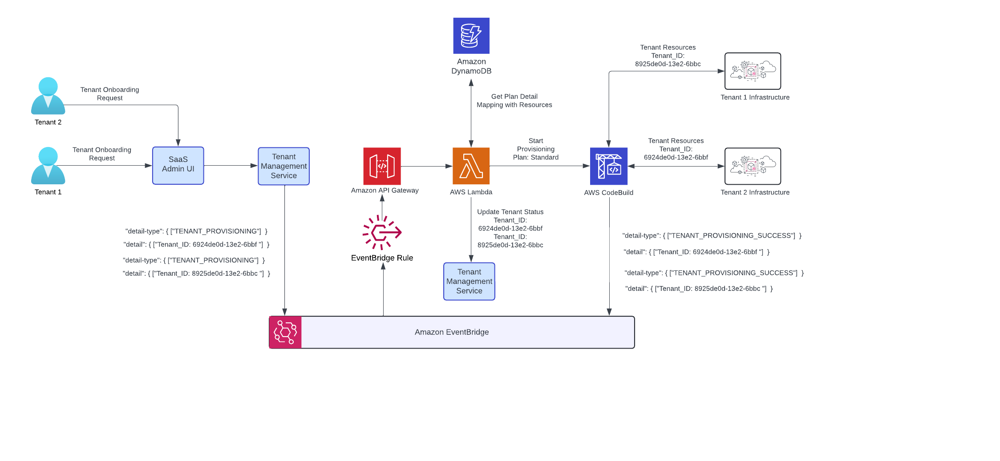

<a style="position: relative; top: 10px;" href="https://sourcefuse.github.io/arc-docs/arc-api-docs" target="_blank"></a>

# [@sourceloop/ctrl-plane-orchestrator-service](https://github.com/sourcefuse/arc-saas/tree/master/services/orchestrator-service)

<p align="left">
<a href="https://www.npmjs.org/package/@sourceloop/ctrl-plane-orchestrator-service">

</a>
<a href="https://github.com/sourcefuse/arc-saas/graphs/contributors" target="_blank">

</a>
<a href="https://www.npmjs.com/@sourceloop/ctrl-plane-orchestrator-service" target="_blank">

</a>
<a href="./LICENSE">

</a>
<a href="https://loopback.io/" target="_blank">

</a>
</p>

## Overview

The `@sourceloop/ctrl-plane-orchestrator-service` is designed to provide the standard interfaces and endpoint to handle the events sent to/from a SaaS Control Plane. This acts as a orchestrator for the event targets/processors.

Consider the following example architecture that uses Amazon EventBridge at the center to pass on the events, and this Orchestrator service is used as its initial target, so that the events can then be sent to the expected candidates to process the event.



Above example is of a tenant provisioning event flow, as shown it originates from a control plane service called tenant management service and then when it's received to the Amazon EventBridge, it passes it to the orchestrator service which can run any bussiness logic before it's sent for processing (the example illustrates starting the codebuild or jenkins job conditionally based on the event). Further code examples in this README will take this same reference.

## Installation

```bash
npm i @sourceloop/ctrl-plane-orchestrator-service
```

## Getting Started

You can start using `@sourceloop/ctrl-plane-orchestrator-service` in just 4 steps:

1. [Bind Component](#bind-component)
2. [Implement Consumers](#implement-consumers)

### Bind Component

Bind the `OrchestratorServiceComponent` to your application constructor as shown below, this will load the built-in artifacts provided by the service in your application to use.

```ts
import {OrchestratorServiceComponent} from '@sourceloop/ctrl-plane-orchestrator-service';
// ...
export class MyApplication extends BootMixin(
  ServiceMixin(RepositoryMixin(RestApplication)),
) {
  constructor(options: ApplicationConfig = {}) {
    // ...
    this.component(OrchestratorServiceComponent);
  }
}
```

This microservice uses [message-bus-connector](https://github.com/sourcefuse/loopback4-message-bus-connector) component for consuming the events triggered through the [tenant-managenet](https://www.npmjs.com/package/@sourceloop/ctrl-plane-tenant-management-service) microservice. It supports multiple message buses.

#### Usage

Bind the `EventStreamConnectorComponent` to your application constructor as shown below.
This will load the built-in artifacts provided by the Message Bus Connector, enabling event publishing and consumption across different backends like EventBridge, SQS, or BullMQ.

```ts
this.component(EventStreamConnectorComponent);
```

### Implement Consumers

Each event type can have one or more Consumers, responsible for reacting to specific messages from the message bus.
Use the @consumer decorator to register them automatically.
Follow the example as below:

```ts
import {consumer, IConsumer, QueueType} from 'loopback4-message-bus-connector';
import {DefaultEventTypes} from '@arc-saas/orchestrator-service';
import {AnyObject} from '@loopback/repository';

@consumer
export class TenantDeploymentConsumer implements IConsumer<AnyObject, string> {
  event = DefaultEventTypes.TENANT_DEPLOYMENT;
  queue = QueueType.EventBridge;

  async handle(detail: AnyObject): Promise<void> {
    console.log('Tenant deployment event received:', detail);
    // Add your business logic here
  }
}
```

## Example Implementations

For more detailed implementation examples, environment setup, and message bus usage (EventBridge, BullMQ, SQS),
please refer to [sandbox](https://github.com/sourcefuse/arc-saas-sandbox) application.

## Deployment

The @sourceloop/ctrl-plane-orchestrator-service can be deployed in various ways, including as a serverless application. Here's how you can set it up for serverless deployment, specifically for AWS Lambda.

### Serverless Deployment

To deploy this service as a serverless application on AWS Lambda, follow these steps:

1. Add a `lambda.ts` file in your `src` directory. This file will serve as the Lambda entry point:

```typescript
import {APIGatewayEvent, APIGatewayProxyEvent, Context} from 'aws-lambda';
const serverlessExpress = require('@vendia/serverless-express');

export * from './application';
let serverlessApp: (arg0: APIGatewayProxyEvent, arg1: Context) => any;

export async function setup(event: APIGatewayEvent, context: Context) {
  const {OrchestratorService} = require('./application');
  const config = {
    rest: {
      openApiSpec: {
        setServersFromRequest: true,
      },
    },
  };
  const app = new OrchestratorService(config);
  await app.boot();
  const requestHandler = app.restServer.requestHandler;
  serverlessApp = serverlessExpress({app: requestHandler});
  return serverlessApp(event, context);
}

export const handler = async (event: APIGatewayEvent, context: Context) => {
  if (serverlessApp) {
    return serverlessApp(event, context);
  }

  return setup(event, context);
};
```

2. Create a Dockerfile in your project root:

```dockerfile
FROM public.ecr.aws/lambda/nodejs:20-x86_64 AS BUILD_IMAGE

RUN mkdir -p ${LAMBDA_TASK_ROOT}

WORKDIR ${LAMBDA_TASK_ROOT}

COPY package*.json ./

RUN npm install

COPY . .

RUN npm run build

CMD [ "./dist/lambda.handler" ]
```

3. Build your Docker image:

```bash
docker build -t orchestrator-service .
```

4. Push the Docker image to your container registry (e.g., Amazon ECR).

5. Create a Lambda function using the pushed container image.

6. Configure an API Gateway to trigger your Lambda function.

This setup allows you to run your Orchestrator Service as a serverless application, leveraging AWS Lambda's scalability and cost-efficiency.
Remember to adjust your Lambda function's configuration (memory, timeout, etc.) based on your specific needs.

### API Documentation

#### API Details

Visit the [OpenAPI spec docs](./openapi.md) for more details on the APIs provided in this service.

## License

ARC SaaS is [MIT licensed](./LICENSE).
