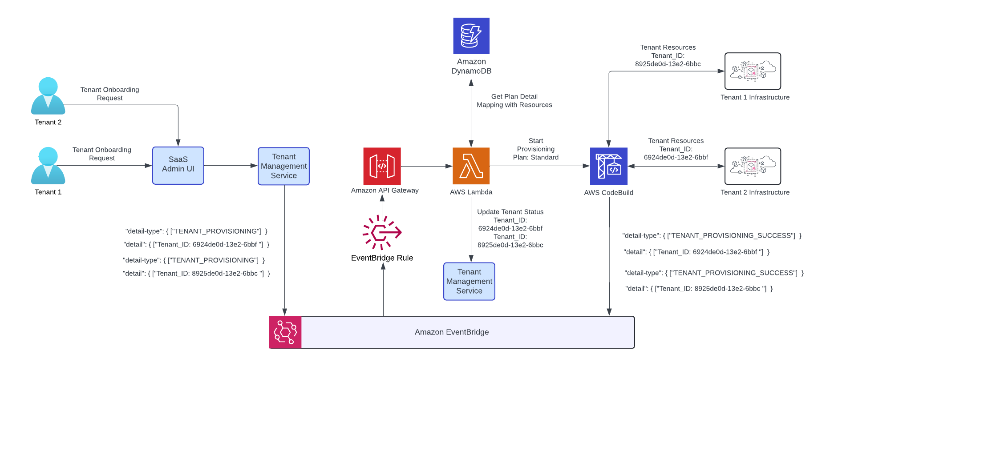

<a style="position: relative; top: 10px;" href="https://sourcefuse.github.io/arc-docs/arc-api-docs" target="_blank"></a>

# [@sourceloop/ctrl-plane-orchestrator-service](https://github.com/sourcefuse/arc-saas/tree/master/services/orchestrator-service)

<p align="left">
<a href="https://www.npmjs.org/package/@sourceloop/ctrl-plane-orchestrator-service">

</a>
<a href="https://github.com/sourcefuse/arc-saas/graphs/contributors" target="_blank">

</a>
<a href="https://www.npmjs.com/@sourceloop/ctrl-plane-orchestrator-service" target="_blank">

</a>
<a href="./LICENSE">

</a>
<a href="https://loopback.io/" target="_blank">

</a>
<a href="https://github.com/nodejs/node/blob/master/doc/changelogs/CHANGELOG_V22.md" target="_blank">

</a>
</p>

## Overview

The `@sourceloop/ctrl-plane-orchestrator-service` is designed to provide standard interfaces and endpoints to handle events sent to/from a SaaS Control Plane. This service acts as an orchestrator for event targets/processors, enabling event-driven architecture patterns for multi-tenant SaaS applications.

### Key Features

- **Event Orchestration**: Central hub for processing events from various SaaS control plane services
- **Message Bus Integration**: Built-in support for multiple message buses (AWS EventBridge, SQS, BullMQ) via [loopback4-message-bus-connector](https://github.com/sourcefuse/loopback4-message-bus-connector)
- **Extensible Provider Pattern**: Override default providers for custom business logic
- **Standard Event Types**: Pre-defined event types for tenant provisioning and deployment workflows
- **OpenAPI Documentation**: Comprehensive API documentation for easy integration

### Architecture

Consider the following example architecture that uses Amazon EventBridge at the center to pass events, with the Orchestrator service as the initial target. Events can be sent to expected candidates for processing:



The above example shows a tenant provisioning event flow. It originates from a control plane service called tenant management service, is received by Amazon EventBridge, and then passed to the orchestrator service which can run business logic before sending it for processing (e.g., starting CodeBuild or Jenkins jobs conditionally based on the event).

## Installation

```bash
npm i @sourceloop/ctrl-plane-orchestrator-service
```

## Getting Started

You can start using `@sourceloop/ctrl-plane-orchestrator-service` in just 2 steps:

1. [Bind Component](#bind-component)
2. [Implement Consumers](#implement-consumers)

### Bind Component

Bind the `OrchestratorServiceComponent` to your application constructor as shown below. This will load the built-in artifacts provided by the service in your application to use.

```ts
import {OrchestratorServiceComponent} from '@sourceloop/ctrl-plane-orchestrator-service';
// ...
export class MyApplication extends BootMixin(
  ServiceMixin(RepositoryMixin(RestApplication)),
) {
  constructor(options: ApplicationConfig = {}) {
    // ...
    this.component(OrchestratorServiceComponent);
  }
}
```

This microservice uses [loopback4-message-bus-connector](https://github.com/sourcefuse/loopback4-message-bus-connector) for consuming events triggered through services like [tenant-management-service](https://www.npmjs.com/package/@sourceloop/ctrl-plane-tenant-management-service). It supports multiple message buses including AWS EventBridge, SQS, and BullMQ.

### Default Event Types

The service provides the following default event types that can be consumed:

| Event Type | Description |
|------------|-------------|
| `TENANT_PROVISIONING` | Triggered when a new tenant is being provisioned |
| `TENANT_DEPROVISIONING` | Triggered when a tenant is being deprovisioned |
| `TENANT_PROVISIONING_SUCCESS` | Triggered when tenant provisioning succeeds |
| `TENANT_PROVISIONING_FAILURE` | Triggered when tenant provisioning fails |
| `TENANT_DEPLOYMENT` | Triggered when tenant deployment starts |
| `TENANT_DEPLOYMENT_SUCCESS` | Triggered when tenant deployment succeeds |
| `TENANT_DEPLOYMENT_FAILURE` | Triggered when tenant deployment fails |

### Implement Consumers

Each event type can have one or more Consumers, responsible for reacting to specific messages from the message bus. Use the `@consumer` decorator to register them automatically.

```ts
import {consumer, IConsumer, QueueType} from 'loopback4-message-bus-connector';
import {DefaultEventTypes} from '@sourceloop/ctrl-plane-orchestrator-service';
import {AnyObject} from '@loopback/repository';

@consumer
export class TenantDeploymentConsumer implements IConsumer<AnyObject, string> {
  event = DefaultEventTypes.TENANT_DEPLOYMENT;
  queue = QueueType.EventBridge;

  async handle(detail: AnyObject): Promise<void> {
    console.log('Tenant deployment event received:', detail);
    // Add your business logic here
  }
}
```

### Service Providers

The component includes the following providers that can be overridden:

- **`OrchestratorServiceBindings.TIER_DETAILS_PROVIDER`**: Provider for fetching tier-specific details. Override this to supply custom logic for retrieving tier configuration.

```ts
import {OrchestratorServiceBindings} from '@sourceloop/ctrl-plane-orchestrator-service';

export class CustomTierDetailsProvider implements Provider<TierDetailsFn> {
  value() {
    return async (tier: string) => {
      // Your custom implementation
      return {
        jobIdentifier: `${tier}-custom-job`,
        // Additional tier details
      };
    };
  }
}

// In your application constructor:
this.bind(OrchestratorServiceBindings.TIER_DETAILS_PROVIDER).toProvider(CustomTierDetailsProvider);
```

- **`OrchestratorServiceBindings.BUILDER_SERVICE`**: Service for starting CI/CD jobs. Override this to integrate with your build system.

```ts
export class CustomBuilderService implements BuilderServiceInterface {
  async startJob(jobIdentifier: string, params: AnyObject): Promise<void> {
    // Your custom implementation for starting jobs
    // e.g., trigger Jenkins, AWS CodeBuild, etc.
  }
}

// In your application constructor:
this.bind(OrchestratorServiceBindings.BUILDER_SERVICE).toClass(CustomBuilderService);
```

## Configuration

The service supports the following environment variables (see `.env.example`):

```bash
NODE_ENV=development
LOG_LEVEL=info
```

Additional configuration for the message bus connector should be set up according to the [loopback4-message-bus-connector documentation](https://github.com/sourcefuse/loopback4-message-bus-connector).

## Example Implementations

For more detailed implementation examples, environment setup, and message bus usage (EventBridge, BullMQ, SQS), please refer to the [sandbox](https://github.com/sourcefuse/arc-saas-sandbox) application.

## API Documentation

The service provides comprehensive API documentation via OpenAPI specification:

- **OpenAPI Spec**: See [openapi.md](./openapi.md) for detailed API documentation
- **Available Endpoints**:
  - `GET /` - Home page with service information
  - `GET /ping` - Health check endpoint

## Deployment

The `@sourceloop/ctrl-plane-orchestrator-service` can be deployed in various ways, including as a serverless application. Here's how you can set it up for serverless deployment on AWS Lambda.

### Serverless Deployment

1. Add a `lambda.ts` file in your `src` directory as the Lambda entry point:

```typescript
import {APIGatewayEvent, APIGatewayProxyEvent, Context} from 'aws-lambda';
const serverlessExpress = require('@vendia/serverless-express');

export * from './application';
let serverlessApp: (arg0: APIGatewayProxyEvent, arg1: Context) => any;

export async function setup(event: APIGatewayEvent, context: Context) {
  const {OrchestratorService} = require('./application');
  const config = {
    rest: {
      openApiSpec: {
        setServersFromRequest: true,
      },
    },
  };
  const app = new OrchestratorService(config);
  await app.boot();
  const requestHandler = app.restServer.requestHandler;
  serverlessApp = serverlessExpress({app: requestHandler});
  return serverlessApp(event, context);
}

export const handler = async (event: APIGatewayEvent, context: Context) => {
  if (serverlessApp) {
    return serverlessApp(event, context);
  }

  return setup(event, context);
};
```

2. Create a Dockerfile in your project root:

```dockerfile
FROM public.ecr.aws/lambda/nodejs:20-x86_64 AS BUILD_IMAGE

RUN mkdir -p ${LAMBDA_TASK_ROOT}

WORKDIR ${LAMBDA_TASK_ROOT}

COPY package*.json ./

RUN npm install

COPY . .

RUN npm run build

CMD [ "./dist/lambda.handler" ]
```

3. Build your Docker image:

```bash
docker build -t orchestrator-service .
```

4. Push the Docker image to your container registry (e.g., Amazon ECR).

5. Create a Lambda function using the pushed container image.

6. Configure an API Gateway to trigger your Lambda function.

This setup allows you to run your Orchestrator Service as a serverless application, leveraging AWS Lambda's scalability and cost-efficiency. Adjust your Lambda function's configuration (memory, timeout, etc.) based on your specific needs.

## License

ARC SaaS is [MIT licensed](./LICENSE).
