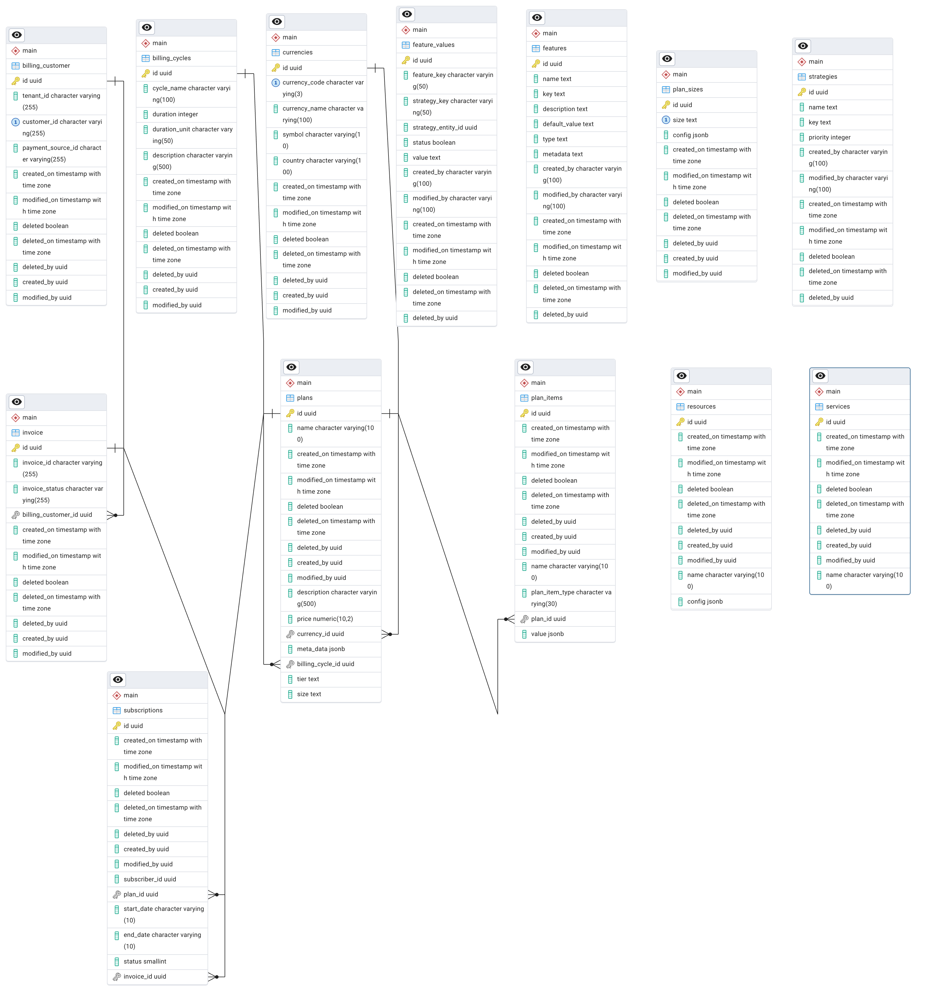

<a style="position: relative; top: 10px;" href="https://sourcefuse.github.io/arc-docs/arc-api-docs" target="_blank"></a>

# [@sourceloop/ctrl-plane-subscription-service](https://github.com/sourcefuse/arc-saas/tree/master/services/subscription-service)

<p align="left">
<a href="https://www.npmjs.org/package/@sourceloop/ctrl-plane-subscription-service">

</a>
<a href="https://github.com/sourcefuse/arc-saas/graphs/contributors" target="_blank">

</a>
<a href="https://www.npmjs.com/@sourceloop/ctrl-plane-subscription-service" target="_blank">

</a>
<a href="./LICENSE">

</a>
<a href="https://loopback.io/" target="_blank">

</a>
<a href="https://github.com/nodejs/node/blob/master/doc/changelogs/CHANGELOG_V22.md" target="_blank">

</a>
</p>

## Overview

The Subscription Service is a core component of the ARC SaaS control plane, responsible for managing subscription plans, billing cycles, and invoice generation.

### Key Features

- **Plan Management**: Create and manage subscription plans with different tiers (siloed/pooled)
- **Plan Customization**: Configure plan sizes and feature sets for different service tiers
- **Subscription Lifecycle**: Create, update, and track subscriptions throughout their lifecycle
- **Feature Toggle Integration**: Dynamic feature management using [@sourceloop/feature-toggle-service](https://www.npmjs.com/package/@sourceloop/feature-toggle-service)
- **Billing Integration**: Built-in support for Stripe and Chargebee payment processors via [loopback4-billing](https://github.com/sourcefuse/loopback4-billing)
- **Invoice Management**: Generate and manage customer invoices
- **Multi-ORM Support**: Default LoopBack CRUD + Sequelize component option
- **OpenTelemetry**: Distributed tracing support with Jaeger exporter

## Installation

```bash
npm i @sourceloop/ctrl-plane-subscription-service
```

## Getting Started

### Basic Setup

1. **Create a LoopBack 4 Application** (if you don't have one already):

```bash
lb4 testapp
```

2. **Install the service**:

```bash
npm i @sourceloop/ctrl-plane-subscription-service
```

3. **Set the environment variables** (see [Environment Variables](#environment-variables))

4. **Run the migrations** (see [Migrations](#migrations))

5. **Add the component to your application** (`application.ts`):

```typescript
import {SubscriptionServiceComponent} from '@sourceloop/ctrl-plane-subscription-service';

export class MyApplication extends BootMixin(
  ServiceMixin(RepositoryMixin(RestApplication)),
) {
  constructor(options: ApplicationConfig = {}) {
    super(options);
    this.component(SubscriptionServiceComponent);
  }
}
```

### Sequelize ORM Support

If you prefer to use Sequelize as your ORM:

```typescript
import {SubscriptionSequelizeServiceComponent} from '@sourceloop/ctrl-plane-subscription-service/sequelize';

// In your application constructor
this.component(SubscriptionSequelizeServiceComponent);
```

### Custom Authentication Sequence

This microservice uses [loopback4-authentication](https://www.npmjs.com/package/loopback4-authentication) and [@sourceloop/core](https://www.npmjs.com/package/@sourceloop/core). By default, it uses asymmetric token encryption. To override with a custom sequence:

1. Install required packages:

```bash
npm install @sourceloop/core loopback4-authorization loopback4-authentication
```

2. Configure in `application.ts`:

```typescript
import {
  AuthenticationComponent,
  BearerVerifierComponent,
  BearerVerifierBindings,
  BearerVerifierConfig,
  BearerVerifierType,
  ServiceSequence,
} from '@sourceloop/core';
import {AuthorizationBindings, AuthorizationComponent} from 'loopback4-authorization';

// Use custom sequence
this.bind(SubscriptionServiceBindings.Config).to({
  useCustomSequence: true,
});

this.component(AuthenticationComponent);
this.sequence(ServiceSequence);

// Add bearer verifier component
this.bind(BearerVerifierBindings.Config).to({
  type: BearerVerifierType.service,
  useSymmetricEncryption: true,
} as BearerVerifierConfig);
this.component(BearerVerifierComponent);

// Add authorization component
this.bind(AuthorizationBindings.CONFIG).to({
  allowAlwaysPaths: ['/explorer', '/openapi.json'],
});
this.component(AuthorizationComponent);

// Comment out default sequence
// this.sequence(MySequence);
```

### Data Source Configuration

The service requires two datasources:

**1. SubscriptionDB** - Main subscription data:

```typescript
import {inject, lifeCycleObserver, LifeCycleObserver} from '@loopback/core';
import {juggler} from '@loopback/repository';
import {SubscriptionDbSourceName} from '@sourceloop/ctrl-plane-subscription-service';

const config = {
  name: SubscriptionDbSourceName,
  connector: 'postgresql',
  host: process.env.DB_HOST,
  port: process.env.DB_PORT,
  user: process.env.DB_USER,
  password: process.env.DB_PASSWORD,
  database: process.env.DB_DATABASE,
  schema: process.env.DB_SCHEMA,
};

@lifeCycleObserver('datasource')
export class SubscriptionDb extends juggler.DataSource implements LifeCycleObserver {
  static dataSourceName = SubscriptionDbSourceName;
  static readonly defaultConfig = config;

  constructor(
    @inject(`datasources.config.${SubscriptionDbSourceName}`, {optional: true})
    dsConfig: object = config,
  ) {
    super(dsConfig);
  }
}
```

**2. FeatureToggleDB** - Feature toggle data:

```typescript
import {inject, lifeCycleObserver, LifeCycleObserver} from '@loopback/core';
import {juggler} from '@loopback/repository';
import {FeatureToggleDbName} from '@sourceloop/feature-toggle-service';

const config = {
  name: FeatureToggleDbName,
  connector: 'postgresql',
  host: process.env.FEATURE_DB_HOST,
  port: process.env.FEATURE_DB_PORT,
  user: process.env.FEATURE_DB_USER,
  password: process.env.FEATURE_DB_PASSWORD,
  database: process.env.FEATURE_DB_DATABASE,
  schema: process.env.FEATURE_DB_SCHEMA,
};

@lifeCycleObserver('datasource')
export class FeatureToggleDb extends juggler.DataSource implements LifeCycleObserver {
  static dataSourceName = FeatureToggleDbName;
  static readonly defaultConfig = config;

  constructor(
    @inject('datasources.config.feature', {optional: true})
    dsConfig: object = config,
  ) {
    super(dsConfig);
  }
}
```

## Plan Customization

This feature allows the creation and management of plans with different sizes and feature sets.

### Plan Sizes

Plan sizes define the scope or capacity of a plan:

| Property | Type | Required | Description |
|----------|------|----------|-------------|
| `size` | string | Y | Name/label of the plan size (e.g., "Standard", "Premium") |
| `config` | object | N | Additional configuration specific to the plan size |

Example: The "Standard" plan may include less database capacity than the "Premium" plan.

### Plan Features

Uses the [@sourceloop/feature-toggle-service](https://www.npmjs.com/package/@sourceloop/feature-toggle-service) to manage feature sets for plans.

| Concept | Description |
|---------|-------------|
| **Feature** | A general capability offered in plans |
| **FeatureValues** | Associates features with specific plans and configures their values |

## Billing Integration

The service integrates billing functionality using [loopback4-billing](https://github.com/sourcefuse/loopback4-billing), supporting multiple payment providers.

### Enable Billing Component

```typescript
import {BillingComponent} from 'loopback4-billing';

this.application.component(BillingComponent);
```

### Use Billing Provider

```typescript
import {BillingComponentBindings, IService} from 'loopback4-billing';

export class BillingInvoiceController {
  constructor(
    @inject(BillingComponentBindings.BillingProvider)
    private readonly billingProvider: IService,
  ) {}
}
```

### Stripe Configuration

**Environment Variables:**

| Variable | Required | Description |
|----------|----------|-------------|
| `STRIPE_SECRET` | Y | Stripe secret key |

**Application Setup:**

```typescript
import {StripeBindings, BillingComponentBindings} from 'loopback4-billing';
import {StripeServiceProvider} from 'loopback4-billing';

// Bind config
this.bind(StripeBindings.config).to({
  secretKey: process.env.STRIPE_SECRET ?? '',
});

// Register provider
this.bind(BillingComponentBindings.SDKProvider).toProvider(
  StripeServiceProvider,
);
```

### Chargebee Configuration

**Environment Variables:**

| Variable | Required | Description |
|----------|----------|-------------|
| `API_KEY` | Y | Chargebee API key |
| `SITE` | Y | Chargebee site URL |

**Application Setup:**

```typescript
import {ChargeBeeBindings, BillingComponentBindings} from 'loopback4-billing';
import {ChargeBeeServiceProvider} from 'loopback4-billing';

// Bind config
this.bind(ChargeBeeBindings.config).to({
  site: process.env.SITE ?? '',
  apiKey: process.env.API_KEY ?? '',
});

// Register provider
this.bind(BillingComponentBindings.SDKProvider).toProvider(
  ChargeBeeServiceProvider,
);
```

## API Documentation

Visit the [OpenAPI spec docs](./openapi.md) for complete API documentation.

**Main Controllers:**
- **PlanController** - Plan CRUD operations
- **PlanSizesController** - Plan size management
- **PlanFeaturesController** - Plan feature configuration
- **SubscriptionController** - Subscription lifecycle management
- **BillingInvoiceController** - Invoice generation and management
- **BillingCustomerController** - Customer billing information
- **BillingCycleController** - Billing cycle management
- **CurrencyController** - Currency management
- **ResourceController** - Resource allocation tracking
- **ServiceController** - Service catalog management

## Database Schema



**Core Tables:**

| Table | Description |
|-------|-------------|
| **Plan** | Subscription plan definitions |
| **PlanSize** | Plan size configurations |
| **FeatureValue** | Feature values for plans |
| **Subscription** | Active subscriptions |
| **Invoice** | Billing invoices |
| **Resource** | Allocated resources |
| **Service** | Available services |

## Environment Variables

<table>
  <thead>
    <tr>
      <th>Name</th>
      <th>Required</th>
      <th>Description</th>
      <th>Default</th>
    </tr>
  </thead>
  <tbody>
    <tr>
      <td colspan="4"><strong>General</strong></td>
    </tr>
    <tr>
      <td>NODE_ENV</td>
      <td>Y</td>
      <td>Node environment (dev, test, prod)</td>
      <td></td>
    </tr>
    <tr>
      <td>LOG_LEVEL</td>
      <td>Y</td>
      <td>Log level (error, warn, info, debug)</td>
      <td></td>
    </tr>
    <tr>
      <td colspan="4"><strong>Main Database</strong></td>
    </tr>
    <tr>
      <td>DB_HOST</td>
      <td>Y</td>
      <td>Database hostname</td>
      <td></td>
    </tr>
    <tr>
      <td>DB_PORT</td>
      <td>Y</td>
      <td>Database port</td>
      <td></td>
    </tr>
    <tr>
      <td>DB_USER</td>
      <td>Y</td>
      <td>Database user</td>
      <td></td>
    </tr>
    <tr>
      <td>DB_PASSWORD</td>
      <td>Y</td>
      <td>Database password</td>
      <td></td>
    </tr>
    <tr>
      <td>DB_DATABASE</td>
      <td>Y</td>
      <td>Database name</td>
      <td></td>
    </tr>
    <tr>
      <td colspan="4"><strong>Feature Toggle Database</strong></td>
    </tr>
    <tr>
      <td>FEATURE_DB_HOST</td>
      <td>Y</td>
      <td>Feature DB hostname</td>
      <td></td>
    </tr>
    <tr>
      <td>FEATURE_DB_PORT</td>
      <td>Y</td>
      <td>Feature DB port</td>
      <td></td>
    </tr>
    <tr>
      <td>FEATURE_DB_USER</td>
      <td>Y</td>
      <td>Feature DB user</td>
      <td></td>
    </tr>
    <tr>
      <td>FEATURE_DB_PASSWORD</td>
      <td>Y</td>
      <td>Feature DB password</td>
      <td></td>
    </tr>
    <tr>
      <td>FEATURE_DB_DATABASE</td>
      <td>Y</td>
      <td>Feature DB name</td>
      <td></td>
    </tr>
    <tr>
      <td>FEATURE_DB_SCHEMA</td>
      <td>Y</td>
      <td>Feature DB schema</td>
      <td></td>
    </tr>
    <tr>
      <td colspan="4"><strong>Redis Cache</strong></td>
    </tr>
    <tr>
      <td>REDIS_HOST</td>
      <td>Y</td>
      <td>Redis hostname</td>
      <td></td>
    </tr>
    <tr>
      <td>REDIS_PORT</td>
      <td>Y</td>
      <td>Redis port</td>
      <td></td>
    </tr>
    <tr>
      <td>REDIS_URL</td>
      <td>Y</td>
      <td>Redis connection URL</td>
      <td></td>
    </tr>
    <tr>
      <td>REDIS_PASSWORD</td>
      <td>Y</td>
      <td>Redis password</td>
      <td></td>
    </tr>
    <tr>
      <td>REDIS_DATABASE</td>
      <td>Y</td>
      <td>Redis database number</td>
      <td></td>
    </tr>
    <tr>
      <td colspan="4"><strong>JWT</strong></td>
    </tr>
    <tr>
      <td>JWT_SECRET</td>
      <td>Y</td>
      <td>Symmetric signing key</td>
      <td></td>
    </tr>
    <tr>
      <td>JWT_ISSUER</td>
      <td>Y</td>
      <td>JWT issuer</td>
      <td></td>
    </tr>
    <tr>
      <td colspan="4"><strong>Stripe (Optional)</strong></td>
    </tr>
    <tr>
      <td>STRIPE_SECRET</td>
      <td>Y if using Stripe</td>
      <td>Stripe secret key</td>
      <td></td>
    </tr>
    <tr>
      <td colspan="4"><strong>Chargebee (Optional)</strong></td>
    </tr>
    <tr>
      <td>SITE</td>
      <td>Y if using Chargebee</td>
      <td>Chargebee site URL</td>
      <td></td>
    </tr>
    <tr>
      <td>API_KEY</td>
      <td>Y if using Chargebee</td>
      <td>Chargebee API key</td>
      <td></td>
    </tr>
  </tbody>
</table>

## Migrations

Copy the migrations from the service and customize as needed:

```bash
cp -r node_modules/@sourceloop/ctrl-plane-subscription-service/migrations ./migrations
```

Then apply them to your database.

## License

ARC SaaS is [MIT licensed](./LICENSE).
