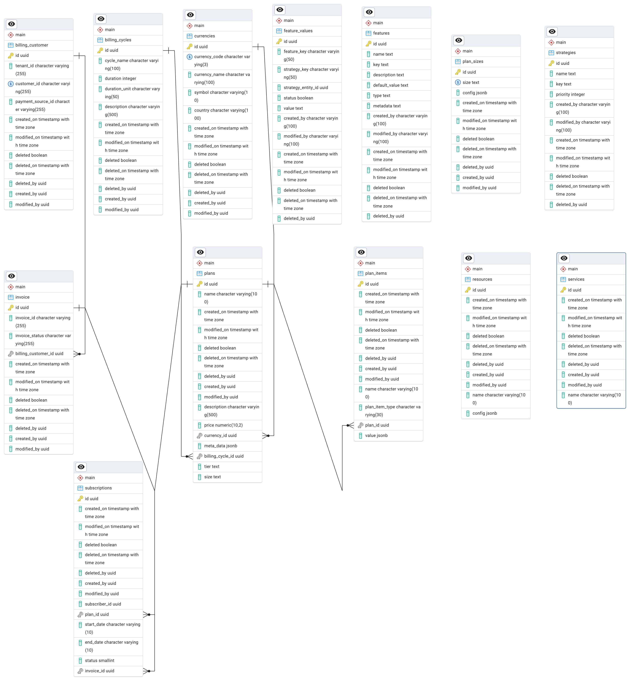

# Subscription-service

[-@2x.png>)](http://loopback.io/)

This is the primary service of the control plane responsible for subscription and plan management.

## Overview

A Microservice for handling subscription management operations. It provides -

- Plan creations and management - plan includes plan tier - silo/pooled
- Add or Update Plan Items/Services/Resources to Plans - plan items are the offerings to user within the selected plan.
- Plan and its feature management.
- Create or Update Subscriptions.
- Get information about expired or expiring subscriptions.
- Billing & Invoice Management.

## Billing & Invoicing

We have created a package [loopback4-billing](https://github.com/sourcefuse/loopback4-billing) that is designed to integrate billing functionality into LoopBack 4 applications. It provides an abstract layer to work with billing services such as Chargebee, Stripe etc, offering common billing operations like creating and managing customers, invoices, payment sources, and transactions. Our subscription service uses this billing package for bill settlement.

## Customizing Plans with Sizes and Features

This feature allows the creation and management of plans with different sizes and features. Plans are used to represent various service tiers or options you offer to your customers. Sizes define the overall scope or capacity of a plan, while features are specific functionalities that can be enabled or disabled for each plan.

The Plan Customization feature consists of two main aspects:

- Plan Sizes: Manage different plan sizes and their configurations.
- Plan Features: Customize features associated with a specific plan.

#### Plan Sizes

Plan sizes are defined by the PlanSizes model. Here's a breakdown of PlanSize:

- size: The name or label of the plan size (string, required)
- config: An optional object that can hold additional configuration details specific to the plan size

For example, the “Standard” plan may include less database capacity than the “Premium” plan.

#### Plan Features

Uses our [@sourceloop/feature-toggle-service](https://www.npmjs.com/package/@sourceloop/feature-toggle-service) to manage the list of features that the application plan will have.

Plan features are saved in the FeatureValues model and associated with plans using the PlanFeaturesController. Here's a breakdown of the relevant concepts:

- Feature: Represents a general capability or functionality offered in your plans.
- FeatureValues: This model associates features with specific plans and allows configuration of their values.

## Installation

Install Subscription service using `npm`;

```sh
$ [npm install | yarn add] @sourceloop/ctrl-plane-subscription-service
```

## Usage

- Create a new Loopback4 Application (If you don't have one already)
  `lb4 testapp`
- Install the subscription service
  `npm i @sourceloop/ctrl-plane-subscription-service`
- Set the [environment variables](#environment-variables).
- Run the [migrations](#migrations).
- Add the `SubscriptionServiceComponent` to your Loopback4 Application (in `application.ts`).

  ```typescript
  // import the SubscriptionServiceComponent
  import {SubscriptionServiceComponent} from '@sourceloop/ctrl-plane-subscription-service';
  // add Component for subscription-service
  this.component(SubscriptionServiceComponent);
  ```

- If you wish to use Sequelize as the ORM, make sure to use the Sequelize-compatible components,else use the default component.

  ```ts
  //import like this
  import {SubscriptionSequelizeServiceComponent} from '@sourceloop/ctrl-plane-subscription-service/sequelize';
  // bind the component
  this.component(SubscriptionSequelizeServiceComponent);
  ```

This microservice uses [loopback4-authentication](https://www.npmjs.com/package/loopback4-authentication) and [@sourceloop/core](https://www.npmjs.com/package/@sourceloop/core) and that uses asymmetric token encryption and decryption by default for that setup please refer [their](https://www.npmjs.com/package/@sourceloop/authentication-service) documentation but if you wish to override -

- Install following packages
  `npm install @sourceloop/core loopback4-authorization loopback4-authentication`
- Add the following to your `application.ts`

  ```typecript
  this.bind(SubscriptionServiceBindings.Config).to({
      useCustomSequence: true,
    });
    this.component(AuthenticationComponent);
    this.sequence(ServiceSequence);
    // Add bearer verifier component
    this.bind(BearerVerifierBindings.Config).to({
      type: BearerVerifierType.service,
      useSymmetricEncryption: true,
    } as BearerVerifierConfig);
    this.component(BearerVerifierComponent);
    // Add authorization component
    this.bind(AuthorizationBindings.CONFIG).to({
      allowAlwaysPaths: ['/explorer', '/openapi.json'],
    });
    this.component(AuthorizationComponent);
  ```

  comment the following since we are using our custom sequence

  ```typescript
  // Set up the custom sequence
  //this.sequence(MySequence);
  ```

- Set up a [Loopback4 Datasource](https://loopback.io/doc/en/lb4/DataSource.html) with `dataSourceName` property set to
  `SubscriptionDB`.
  This component internally uses [FeatureToggleServiceComponent](https://www.npmjs.com/package/@sourceloop/feature-toggle-service) that requires a datasource binding with the name 'FeatureToggleDB'. Make sure to create a datasource for it. You can refer an example datasource [here](#setting-up-a-datasource).

- Bind any of the custom [providers](#providers) you need.

## Integrating Billing Functionality into Subscription Service using LoopBack 4

We are leveraging the [loopback4-billing](https://github.com/sourcefuse/loopback4-billing) package to integrate billing capabilities into our Subscription Service.

To include billing functionality, we integrate the BillingComponent into the SubscriptionServiceComponent as follows:

```typescript
// import billing component from loopback4-billing
import {BillingComponent} from 'loopback4-billing';
// add Component for subscription-service component
this.application.component(BillingComponent);
```

We utilize the BillingProvider binding from [loopback4-billing](https://github.com/sourcefuse/loopback4-billing) in our controllers as shown below:

```typescript
// import billing component from loopback4-billing
import {BillingComponentBindings,IService} from 'loopback4-billing';
// add Component for subscription-service component
export class BillingInvoiceController {
constructor(
...
  @inject(BillingComponentBindings.BillingProvider)
  private readonly billingProvider: IService,
...
) {}
}
```

Depending on the billing provider, the setup process varies. Currently, we support Stripe and Chargebee.

### For ChargeBee -

To use Chargebee as the billing provider, you need to configure the Chargebee API keys and site URL in your application. You can set these values in the environment variables of your LoopBack 4 project.

```
API_KEY=your_chargebee_api_key
SITE=your_chargebee_site_url
```

Next, bind these values with ChargeBeeBindings.Config and register the Chargebee provider, as shown below:

```typescript
import {ChargeBeeBindings, BillingComponentBindings} from 'loopback4-billing';
import {SubscriptionServiceComponent} from '@sourceloop/ctrl-plane-subscription-service';
export class YourApplication extends BootMixin(
  ServiceMixin(RepositoryMixin(RestApplication)),
) {
  constructor(options: ApplicationConfig = {}) {
    super(options);

    // Bind the config values
    this.bind(ChargeBeeBindings.config).to({
      site: process.env.SITE ?? '',
      apiKey: process.env.API_KEY ?? '',
    });
    // Register Billing component
    this.bind(BillingComponentBindings.SDKProvider).toProvider(
      ChargeBeeServiceProvider,
    );
  }
}
```

### For STRIPE -

To use Stripe as the billing provider, you need to configure the Chargebee API keys and site URL in your application. You can set these values in the environment variables of your LoopBack 4 project.

```
STRIPE_SECRET=your_stripe_secret_key
```

Next, bind these values with StripeBindings.Config and register the Stripe provider, as shown below:

```typescript
import {StripeBindings, BillingComponentBindings} from 'loopback4-billing';
import {SubscriptionServiceComponent} from '@sourceloop/ctrl-plane-subscription-service';
export class YourApplication extends BootMixin(
  ServiceMixin(RepositoryMixin(RestApplication)),
) {
  constructor(options: ApplicationConfig = {}) {
    super(options);

    // Bind the config values
    this.bind(StripeBindings.config).to({
      secretKey: process.env.STRIPE_SECRET ?? '',
    });
    // Register Billing component
    this.bind(BillingComponentBindings.SDKProvider).toProvider(
      StripeServiceProvider,
    );
  }
}
```

### Environment Variables

<table>
  <thead>
    <th>Name</th>
    <th>Required</th>
    <th>Description</th>
    <th>Default Value</th>
  </thead>
  <tbody>
      <tr>
        <td>NODE_ENV</td>
        <td>Y</td>
        <td>Node environment value, i.e. `dev`, `test`, `prod</td>
        <td></td>
      </tr>
      <tr>
        <td>LOG_LEVEL</td>
        <td>Y</td>
        <td>Log level value, i.e. `error`, `warn`, `info`, `verbose`, `debug`</td>
        <td></td>
      </tr>
      <tr>
        <td>DB_HOST</td>
        <td>Y</td>
        <td>Hostname for the database server.</td>
        <td></td>
      </tr>
      <tr>
        <td>DB_PORT</td>
        <td>Y</td>
        <td>Port for the database server.</td>
        <td></td>
      </tr>
      <tr>
        <td>DB_USER</td>
        <td>Y</td>
        <td>User for the database.</td>
        <td></td>
      </tr>
      <tr>
        <td>DB_PASSWORD</td>
        <td>Y</td>
        <td>Password for the database user.</td>
        <td></td>
      </tr>
      <tr>
        <td>DB_DATABASE</td>
        <td>Y</td>
        <td>Database to connect to on the database server.</td>
        <td></td>
      </tr>
      <tr>
        <td>FEATURE_DB_SCHEMA</td>
        <td>Y</td>
        <td>Database schema used for the data source. In PostgreSQL, this will be `public` unless a schema is made explicitly for the service.</td>
        <td></td>
      </tr>
      <tr>
        <td>FEATURE_DB_HOST</td>
        <td>Y</td>
        <td>Hostname for the database server.</td>
        <td></td>
      </tr>
      <tr>
        <td>FEATURE_DB_PORT</td>
        <td>Y</td>
        <td>Port for the database server.</td>
        <td></td>
      </tr>
      <tr>
        <td>FEATURE_DB_USER</td>
        <td>Y</td>
        <td>User for the database.</td>
        <td></td>
      </tr>
      <tr>
        <td>FEATURE_DB_PASSWORD</td>
        <td>Y</td>
        <td>Password for the database user.</td>
        <td></td>
      </tr>
      <tr>
        <td>FEATURE_DB_DATABASE</td>
        <td>Y</td>
        <td>Database to connect to on the database server.</td>
        <td></td>
      </tr>
      <tr>
        <td>FEATURE_DB_SCHEMA</td>
        <td>Y</td>
        <td>Database schema used for the data source. In PostgreSQL, this will be `public` unless a schema is made explicitly for the service.</td>
        <td></td>
      </tr>
      <tr>
        <td>REDIS_HOST</td>
        <td>Y</td>
        <td>Hostname of the Redis server.</td>
        <td></td>
      </tr>
      <tr>
        <td>REDIS_PORT</td>
        <td>Y</td>
        <td>Port to connect to the Redis server over.</td>
        <td></td>
      </tr>
      <tr>
        <td>REDIS_URL</td>
        <td>Y</td>
      <td>Fully composed URL for Redis connection. Used instead of other settings if set.</td>
        <td></td>
      </tr>
      <tr>
        <td>REDIS_PASSWORD</td>
        <td>Y</td>
        <td>Password for Redis if authentication is enabled.</td>
        <td></td>
      </tr>
      <tr>
        <td>REDIS_DATABASE</td>
        <td>Y</td>
        <td>Database within Redis to connect to.</td>
        <td></td>
      </tr>
      <tr>
        <td>JWT_SECRET</td>
        <td>Y</td>
        <td>Symmetric signing key of the JWT token.</td>
        <td></td>
      </tr>
      <tr>
        <td>JWT_ISSUER</td>
        <td>Y</td>
        <td>Issuer of the JWT token.</td>
        <td></td>
      </tr>
      <tr>
        <td>STRIPE_SECRET</td>
        <td>Y if using stripe for payments</td>
        <td>Stripe secret key.</td>
        <td></td>
      </tr>
      <tr>
        <td>SITE</td>
        <td>Y for Chargebee</td>
        <td>SIte URL of Chargebee.</td>
        <td></td>
      </tr>
      <tr>
        <td>API_KEY</td>
        <td>Y for Chargebee</td>
        <td>API key of Chargebee.</td>
        <td></td>
      </tr>

  </tbody>
</table>

### Setting up a `DataSource`

Here is a sample Implementation `DataSource` implementation using environment variables and PostgreSQL as the data source.

```typescript
import {inject, lifeCycleObserver, LifeCycleObserver} from '@loopback/core';
import {juggler} from '@loopback/repository';
import {TenantManagementDbSourceName} from '@sourceloop/tenant-management-service';

const config = {
  name: SubscriptionDbSourceName,
  connector: 'postgresql',
  url: '',
  host: process.env.DB_HOST,
  port: process.env.DB_PORT,
  user: process.env.DB_USER,
  password: process.env.DB_PASSWORD,
  database: process.env.DB_DATABASE,
  schema: process.env.DB_SCHEMA,
};

@lifeCycleObserver('datasource')
export class AuthenticationDbDataSource
  extends juggler.DataSource
  implements LifeCycleObserver
{
  static dataSourceName = SubscriptionDbSourceName;
  static readonly defaultConfig = config;

  constructor(
    // You need to set datasource configuration name as 'datasources.config.Authentication' otherwise you might get Errors
    @inject(`datasources.config.${SubscriptionDbSourceName}`, {optional: true})
    dsConfig: object = config,
  ) {
    super(dsConfig);
  }
}
```

Below is example of a Feature Toggle datasource.

```ts
import {inject, lifeCycleObserver, LifeCycleObserver} from '@loopback/core';
import {juggler} from '@loopback/repository';
import {FeatureToggleDbName} from '@sourceloop/feature-toggle-service';

const config = {
  name: FeatureToggleDbName,
  connector: 'postgresql',
  url: '',
  host: process.env.DB_HOST,
  port: process.env.DB_PORT,
  user: process.env.DB_USER,
  password: process.env.DB_PASSWORD,
  database: process.env.DB_DATABASE,
  schema: process.env.DB_SCHEMA,
};

@lifeCycleObserver('datasource')
export class FeatureToggleDbDataSource
  extends juggler.DataSource
  implements LifeCycleObserver
{
  static dataSourceName = FeatureToggleDbName;
  static readonly defaultConfig = config;

  constructor(
    @inject('datasources.config.feature', {optional: true})
    dsConfig: object = config,
  ) {
    super(dsConfig);
  }
}
```

### Migrations

The migrations required for this service can be copied from the service. You can customize or cherry-pick the migrations in the copied files according to your specific requirements and then apply them to the DB.

## Database Schema


