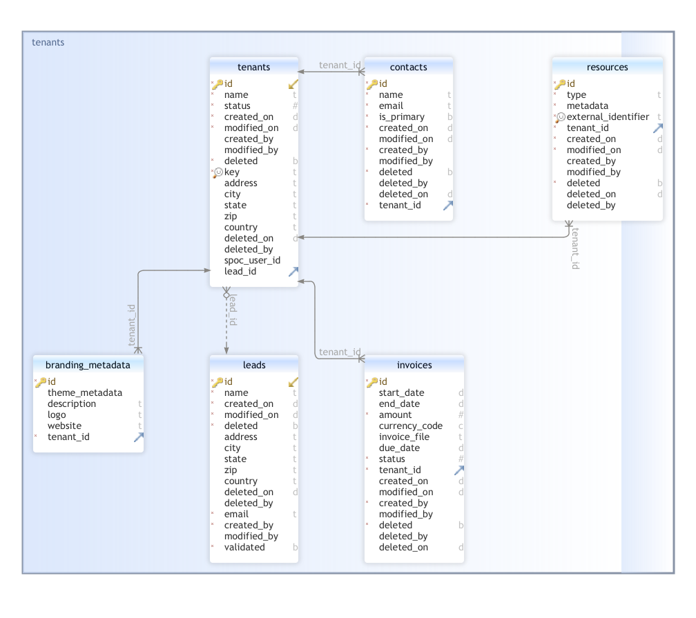

# tenant-mgmt-service

This is the primary service of the control plane responsible for onboarding a tenant and triggering it's provisioning.

## Prerequisites

- Postgresql 16+
- Redis 7+
- node 16+
- npm 8+

## Setup

- install all the required packages using `npm i`
- create an `.env` file with all the required properties. Refer the [`.env.example`](./.env.example) for required env variables
- run the migrations in the `packages/migrations` folder of this monorepo, refer the readme of the package for more details
- run the service using `npm start`

## Database Schema



The major tables in the schema are briefly described below -

**Address** - this model represents the address of a company or lead

**Contact** - this model represents contacts belonging to a tenant

**Invoice** - this model represents an invoice with the amount and period generated for a tenant in the system

**Leads** - this model represents a lead that could eventually be a tenant in the system

**Tenants** - main model of the service that represents a tenant in the system, either pooled or siloed

## Onboarding a tenant

- The onboarding process starts through a concept of a `Lead`. A `Lead` is a prospective client who may or may not end being a tenant in our system.
- The overall flow could be something like this -
  
- The `Lead` is created through POST `/leads` endpoint, which creates a Lead and sends an email to verify the email address of the lead
- The mail has a link which should direct to a front end application, which in turn would call the upcoming api's using a temporary authorization code included in the mail.
- The front end application first calls the `/leads/{id}/verify` which updates the validated status of the lead in the DB and returns a new JWT Token that can be used for subsequent calls
- If the token is validated in the previous step, the UI should call the `/leads/{id}/tenants` endpoint with the necessary payload(as per swagger documentation).
- This endpoint would onboard the tenant in the DB, and the facade is then supposed to trigger the relevant pipeline using the `/tenants/{id}/provision` endpoint

## Webhook Integration

- A webhook endpoint is available in the service that is supposed to update the status of a tenant based on the updates from the third-party responsible for actual provisioning of resources
- To test this from local, ensure that your local service is exposed through a tool like [ngrok](https://ngrok.com/) or [localtunne](https://github.com/localtunnel/localtunnel)
- Your third-party tool is responsible for hitting this endpoint with the expected payload and a signature and timestamp in headers `x-signature` and `x-timestamp` respectively.
- The signature is derived using the following logic (written in Node.js but could be implemented in any other language) -

```js
const timestamp = Date.now();
const secret = process.env.SECRET;
const context = process.env.CONTEXT_ID;
const payload = `{"status":"success", "initiatorId":${process.env.TENANT_ID},"type":0}`;
const signature = crypto
  .createHmac('sha256', secret)
  .update(`${payload}${context}${timestamp}`)
  .digest('hex');
```
