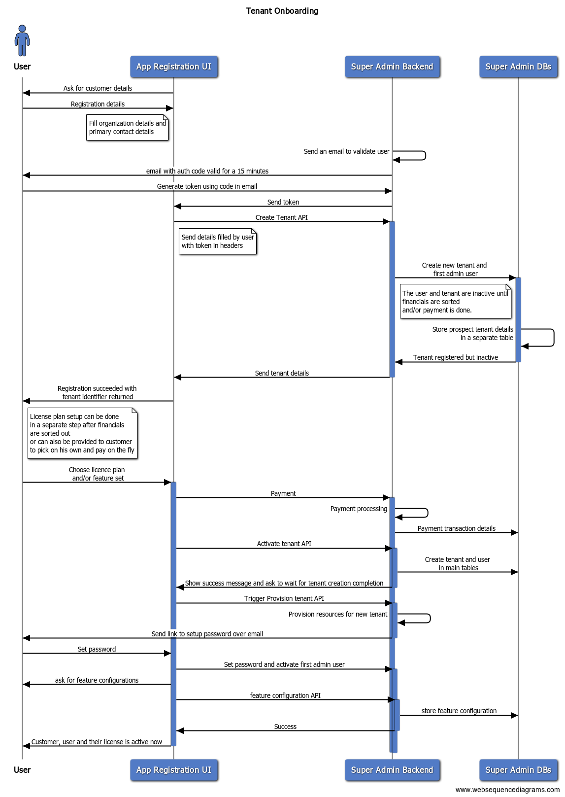
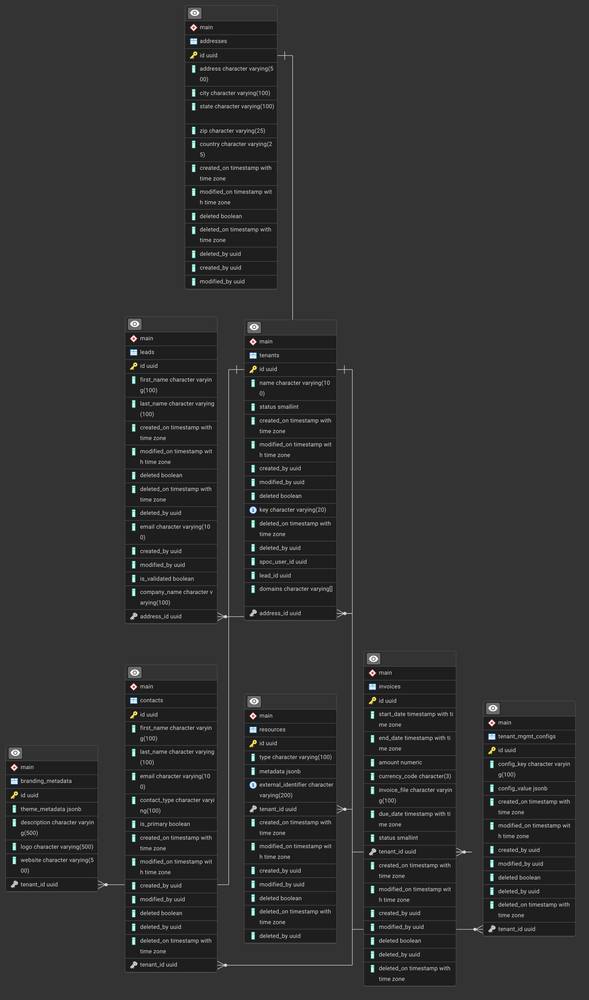

<a style="position: relative; top: 10px;" href="https://sourcefuse.github.io/arc-docs/arc-api-docs" target="_blank"></a>

# [@sourceloop/ctrl-plane-tenant-management-service](https://github.com/sourcefuse/arc-saas/tree/master/services/tenant-management-service)

<p align="left">
<a href="https://www.npmjs.org/package/@sourceloop/ctrl-plane-tenant-management-service">

</a>
<a href="https://github.com/sourcefuse/arc-saas/graphs/contributors" target="_blank">

</a>
<a href="https://www.npmjs.com/@sourceloop/ctrl-plane-tenant-management-service" target="_blank">

</a>
<a href="./LICENSE">

</a>
<a href="https://loopback.io/" target="_blank">

</a>
<a href="https://github.com/nodejs/node/blob/master/doc/changelogs/CHANGELOG_V22.md" target="_blank">

</a>
</p>

## Overview

The Tenant Management Service is the primary service of the ARC SaaS control plane, responsible for onboarding tenants and managing their provisioning lifecycle.

### Key Features

- **Lead Management**: Create and verify prospective tenant leads
- **Tenant Onboarding**: Support for both pooled (shared) and siloed (dedicated) tenant models
- **Event Publishing**: Integrated message bus connector for event-driven provisioning
- **Identity Provider Integration**: Built-in support for Keycloak and Auth0 IDPs
- **Webhook Support**: Receive provisioning status updates from external systems
- **Multi-ORM Support**: Default LoopBack CRUD + Sequelize component option
- **Invoice Generation**: Built-in billing and invoicing capabilities
- **OpenTelemetry**: Distributed tracing support with Jaeger exporter

### Architecture


The tenant onboarding workflow involves lead creation, verification, tenant provisioning, and identity provider setup.

## Installation

```bash
npm i @sourceloop/ctrl-plane-tenant-management-service
```

## Getting Started

### Basic Setup

1. **Create a LoopBack 4 Application** (if you don't have one already):

```bash
lb4 testapp
```

2. **Install the service**:

```bash
npm i @sourceloop/ctrl-plane-tenant-management-service
```

3. **Set the environment variables** (see [Environment Variables](#environment-variables))

4. **Run the migrations** (see [Migrations](#migrations))

5. **Add the component to your application** (`application.ts`):

```typescript
import {TenantManagementServiceComponent} from '@sourceloop/ctrl-plane-tenant-management-service';

export class MyApplication extends BootMixin(
  ServiceMixin(RepositoryMixin(RestApplication)),
) {
  constructor(options: ApplicationConfig = {}) {
    super(options);
    this.component(TenantManagementServiceComponent);
  }
}
```

### Sequelize ORM Support

If you prefer to use Sequelize as your ORM:

```typescript
import {TenantManagementSequelizeServiceComponent} from '@sourceloop/ctrl-plane-tenant-management-service/sequelize';

// In your application constructor
this.component(TenantManagementSequelizeServiceComponent);
```

### Custom Authentication Sequence

This microservice uses [loopback4-authentication](https://www.npmjs.com/package/loopback4-authentication) and [@sourceloop/core](https://www.npmjs.com/package/@sourceloop/core). By default, it uses asymmetric token encryption. To override with custom sequence:

1. Install required packages:

```bash
npm install @sourceloop/core loopback4-authorization loopback4-authentication
```

2. Configure in `application.ts`:

```typescript
import {
  AuthenticationComponent,
  BearerVerifierComponent,
  BearerVerifierBindings,
  BearerVerifierConfig,
  BearerVerifierType,
  ServiceSequence,
} from '@sourceloop/core';
import {AuthorizationBindings, AuthorizationComponent} from 'loopback4-authorization';

// Use custom sequence
this.bind(TenantManagementServiceBindings.Config).to({
  useCustomSequence: true,
});

this.component(TenantManagementServiceComponent);
this.component(AuthenticationComponent);
this.sequence(ServiceSequence);

// Add bearer verifier component
this.bind(BearerVerifierBindings.Config).to({
  type: BearerVerifierType.service,
  useSymmetricEncryption: true,
} as BearerVerifierConfig);
this.component(BearerVerifierComponent);

// Add authorization component
this.bind(AuthorizationBindings.CONFIG).to({
  allowAlwaysPaths: ['/explorer', '/openapi.json'],
});
this.component(AuthorizationComponent);

// Comment out default sequence since we're using custom sequence
// this.sequence(MySequence);
```

### Data Source Configuration

Set up a LoopBack 4 DataSource with `dataSourceName` set to `TenantManagementDB`:

**PostgreSQL Example:**

```typescript
import {inject, lifeCycleObserver, LifeCycleObserver} from '@loopback/core';
import {juggler} from '@loopback/repository';
import {TenantManagementDbSourceName} from '@sourceloop/ctrl-plane-tenant-management-service';

const config = {
  name: TenantManagementDbSourceName,
  connector: 'postgresql',
  host: process.env.DB_HOST,
  port: process.env.DB_PORT,
  user: process.env.DB_USER,
  password: process.env.DB_PASSWORD,
  database: process.env.DB_DATABASE,
  schema: process.env.DB_SCHEMA,
};

@lifeCycleObserver('datasource')
export class TenantManagementDb extends juggler.DataSource implements LifeCycleObserver {
  static dataSourceName = TenantManagementDbSourceName;
  static readonly defaultConfig = config;

  constructor(
    @inject(`datasources.config.${TenantManagementDbSourceName}`, {optional: true})
    dsConfig: object = config,
  ) {
    super(dsConfig);
  }
}
```

**Redis Cache Example:**

```typescript
import {inject, lifeCycleObserver, LifeCycleObserver} from '@loopback/core';
import {juggler} from '@loopback/repository';
import {readFileSync} from 'fs';

const config = {
  name: 'TenantManagementCacheDB',
  connector: 'kv-redis',
  host: process.env.REDIS_HOST,
  port: process.env.REDIS_PORT,
  password: process.env.REDIS_PASSWORD,
  db: process.env.REDIS_DATABASE,
  url: process.env.REDIS_URL,
  tls: process.env.REDIS_TLS_CERT ? {ca: readFileSync(process.env.REDIS_TLS_CERT)} : undefined,
};

@lifeCycleObserver('datasource')
export class RedisDataSource extends juggler.DataSource implements LifeCycleObserver {
  static readonly dataSourceName = 'TenantManagementCacheDB';
  static readonly defaultConfig = config;

  constructor(
    @inject('datasources.config.TenantManagementCacheDB', {optional: true})
    dsConfig: object = config,
  ) {
    super(dsConfig);
  }
}
```

## Usage

### Onboarding a Tenant

The onboarding process starts through a **Lead** - a prospective client who may or may not become a tenant.



**Step 1: Create a Lead**

```bash
POST /leads
```

This creates a Lead and sends an email with a verification link.

**Step 2: Verify the Lead**

```bash
GET /leads/{id}/verify
```

Call this with the temporary authorization code from the email. It validates the lead and returns a JWT token for subsequent calls.

**Step 3: Create Tenant from Lead**

```bash
POST /leads/{id}/tenants
```

With the validated token, create the tenant in the database.

**Step 4: Provision the Tenant**

```bash
POST /tenants/{id}/provision
```

Trigger the provisioning process for the tenant resources.

### Direct Tenant Onboarding

For control plane administrators, tenants can be onboarded directly without the lead flow:

```bash
POST /tenants
```

> **Note**: Only users with control plane admin privileges can perform direct onboarding. Regular users must use the lead-based flow.

### Event Publishing

The service supports event publishing through [loopback4-message-bus-connector](https://www.npmjs.com/package/loopback4-message-bus-connector).

**Enable the component:**

```typescript
import {EventStreamConnectorComponent} from 'loopback4-message-bus-connector';

this.component(EventStreamConnectorComponent);
```

**Publish events:**

```typescript
import {producer, Producer, QueueType} from 'loopback4-message-bus-connector';

export class TenantEventPublisher {
  @producer(QueueType.EventBridge)
  private eventBridgeProducer: Producer;

  async publishTenantProvisionedEvent(payload: any) {
    await this.eventBridgeProducer.send({
      type: 'tenant.provisioned',
      data: payload,
    });
  }
}
```

**Supported Queue Types:**
- `QueueType.EventBridge` → AWS EventBridge
- `QueueType.BullMQ` → Redis-based BullMQ queues
- `QueueType.SQS` → AWS SQS queues

## Identity Provider Integration

The service supports automatic identity provider setup during tenant provisioning.

### Keycloak

**Environment Variables:**

| Variable | Required | Description |
|----------|----------|-------------|
| `KEYCLOAK_HOST` | Y | Keycloak host URL |
| `KEYCLOAK_ADMIN_USERNAME` | Y | Admin username |
| `KEYCLOAK_ADMIN_PASSWORD` | Y | Admin password |
| `NAMESPACE` | Y | SSM namespace for config storage |
| `AWS_REGION` | Y | AWS region for SSM |
| `AWS_SES_SMTP_HOST` | Y | SMTP host for email |
| `AWS_SES_SMTP_USERNAME` | Y | SMTP username |
| `AWS_SES_SMTP_PASSWORD` | Y | SMTP password |
| `SMTP_FROM_EMAIL` | Y | From email address |
| `SMTP_FROM_DISPLAY_NAME` | Y | Email display name |
| `DOMAIN_NAME` | Y | Your domain name |

**What it does:**
- Creates a dedicated Realm for the tenant
- Configures SMTP settings for password reset emails
- Creates a Client with correct redirect URIs
- Creates an Admin User with temporary password
- Triggers password reset email
- Returns the admin user's `authId`

**Bind the provider:**

```typescript
import {TenantManagementServiceBindings} from '@sourceloop/ctrl-plane-tenant-management-service';
import {KeycloakIdpProvider} from '@sourceloop/ctrl-plane-tenant-management-service/idp-provider';

app.bind(TenantManagementServiceBindings.IDP_KEYCLOAK).toProvider(KeycloakIdpProvider);
```

### Auth0

**Environment Variables:**

| Variable | Required | Description |
|----------|----------|-------------|
| `AUTH0_DOMAIN` | Y | Auth0 domain |
| `AUTH0_CLIENT_ID` | Y | Application client ID |
| `AUTH0_CLIENT_SECRET` | Y | Application client secret |
| `AUTH0_AUDIENCE` | N | Token audience |

**What it does:**
- Creates an Auth0 Organization (dedicated for PREMIUM, shared for pooled)
- Applies branding and connection settings
- Creates an Admin User with temporary password
- Adds admin to the organization
- Returns the Auth0 user ID (`authId`)

**Bind the provider:**

```typescript
import {TenantManagementServiceBindings} from '@sourceloop/ctrl-plane-tenant-management-service';
import {Auth0IdpProvider} from '@sourceloop/ctrl-plane-tenant-management-service/idp-provider';

app.bind(TenantManagementServiceBindings.IDP_AUTH0).toProvider(Auth0IdpProvider);
```

## Webhook Integration

Receive provisioning status updates from external systems via webhooks.

**Enable the webhook component:**

```typescript
import {WebhookTenantManagementServiceComponent} from '@sourceloop/ctrl-plane-tenant-management-service';

this.component(WebhookTenantManagementServiceComponent);
```

**Testing locally:** Use a tunneling tool like [ngrok](https://ngrok.com/) or [localtunnel](https://github.com/localtunnel/localtunnel).

**Webhook Headers:**
- `x-signature`: HMAC-SHA256 signature
- `x-timestamp`: Request timestamp

**Signature Generation:**

```javascript
const crypto = require('crypto');
const timestamp = Date.now();
const secret = process.env.SECRET;
const context = process.env.CONTEXT_ID;
const payload = `{"status":"success", "initiatorId":${process.env.TENANT_ID},"type":0}`;
const signature = crypto
  .createHmac('sha256', secret)
  .update(`${payload}${context}${timestamp}`)
  .digest('hex');
```

## API Documentation

Visit the [OpenAPI spec docs](./openapi.md) for complete API documentation including all endpoints, request/response schemas, and authentication requirements.

**Main Controllers:**
- **LeadController** - Lead management and tenant creation
- **TenantController** - Tenant CRUD and provisioning
- **ContactController** - Contact information management
- **InvoiceController** - Invoice generation and management
- **IdpController** - Identity provider configuration

## Database Schema



**Main Tables:**

| Table | Description |
|-------|-------------|
| **Address** | Company/lead address information |
| **Contact** | Tenant contact details |
| **Invoice** | Billing invoices with amount and period |
| **Lead** | Prospective tenant leads |
| **Tenant** | Main tenant entity (pooled or siloed) |
| **TenantMgmtConfig** | Tenant-specific IDP configuration |

## Environment Variables

<table>
  <thead>
    <tr>
      <th>Name</th>
      <th>Required</th>
      <th>Description</th>
      <th>Default</th>
    </tr>
  </thead>
  <tbody>
    <tr>
      <td colspan="4"><strong>General</strong></td>
    </tr>
    <tr>
      <td>NODE_ENV</td>
      <td>Y</td>
      <td>Node environment (dev, test, prod)</td>
      <td></td>
    </tr>
    <tr>
      <td>LOG_LEVEL</td>
      <td>Y</td>
      <td>Log level (error, warn, info, debug)</td>
      <td></td>
    </tr>
    <tr>
      <td colspan="4"><strong>Database</strong></td>
    </tr>
    <tr>
      <td>DB_HOST</td>
      <td>Y</td>
      <td>Database hostname</td>
      <td></td>
    </tr>
    <tr>
      <td>DB_PORT</td>
      <td>Y</td>
      <td>Database port</td>
      <td></td>
    </tr>
    <tr>
      <td>DB_USER</td>
      <td>Y</td>
      <td>Database user</td>
      <td></td>
    </tr>
    <tr>
      <td>DB_PASSWORD</td>
      <td>Y</td>
      <td>Database password</td>
      <td></td>
    </tr>
    <tr>
      <td>DB_DATABASE</td>
      <td>Y</td>
      <td>Database name</td>
      <td></td>
    </tr>
    <tr>
      <td>DB_SCHEMA</td>
      <td>Y</td>
      <td>Database schema (PostgreSQL)</td>
      <td></td>
    </tr>
    <tr>
      <td colspan="4"><strong>Redis Cache</strong></td>
    </tr>
    <tr>
      <td>REDIS_HOST</td>
      <td>Y</td>
      <td>Redis hostname</td>
      <td></td>
    </tr>
    <tr>
      <td>REDIS_PORT</td>
      <td>Y</td>
      <td>Redis port</td>
      <td></td>
    </tr>
    <tr>
      <td>REDIS_URL</td>
      <td>Y</td>
      <td>Redis connection URL</td>
      <td></td>
    </tr>
    <tr>
      <td>REDIS_PASSWORD</td>
      <td>Y</td>
      <td>Redis password</td>
      <td></td>
    </tr>
    <tr>
      <td>REDIS_DATABASE</td>
      <td>Y</td>
      <td>Redis database number</td>
      <td></td>
    </tr>
    <tr>
      <td colspan="4"><strong>JWT</strong></td>
    </tr>
    <tr>
      <td>JWT_SECRET</td>
      <td>Y</td>
      <td>Symmetric signing key</td>
      <td></td>
    </tr>
    <tr>
      <td>JWT_ISSUER</td>
      <td>Y</td>
      <td>JWT issuer</td>
      <td></td>
    </tr>
    <tr>
      <td colspan="4"><strong>Application</strong></td>
    </tr>
    <tr>
      <td>SYSTEM_USER_ID</td>
      <td>Y</td>
      <td>System user ID</td>
      <td></td>
    </tr>
    <tr>
      <td>FROM_EMAIL</td>
      <td>Y</td>
      <td>Notification email sender</td>
      <td></td>
    </tr>
    <tr>
      <td>APP_NAME</td>
      <td>Y</td>
      <td>Application name</td>
      <td></td>
    </tr>
    <tr>
      <td>APP_VALIDATE_URL</td>
      <td>Y</td>
      <td>Frontend validation URL</td>
      <td></td>
    </tr>
    <tr>
      <td>APP_LOGIN_URL</td>
      <td>Y</td>
      <td>Control plane URL</td>
      <td></td>
    </tr>
    <tr>
      <td>VALIDATION_TOKEN_EXPIRY</td>
      <td>Y</td>
      <td>Validation token expiry time</td>
      <td></td>
    </tr>
    <tr>
      <td colspan="4"><strong>Rate Limiting</strong></td>
    </tr>
    <tr>
      <td>PUBLIC_API_MAX_ATTEMPTS</td>
      <td>Y</td>
      <td>Max attempts for public APIs</td>
      <td></td>
    </tr>
    <tr>
      <td>WEBHOOK_API_MAX_ATTEMPTS</td>
      <td>Y</td>
      <td>Max attempts for webhook API</td>
      <td></td>
    </tr>
    <tr>
      <td colspan="4"><strong>Pipeline Configuration</strong></td>
    </tr>
    <tr>
      <td>SILOED_PIPELINE</td>
      <td>Y</td>
      <td>Pipeline key for siloed tenants</td>
      <td></td>
    </tr>
    <tr>
      <td>POOLED_PIPELINE</td>
      <td>Y</td>
      <td>Pipeline key for pooled tenants</td>
      <td></td>
    </tr>
    <tr>
      <td>LEAD_KEY_LENGTH</td>
      <td>Y</td>
      <td>Length of lead random key</td>
      <td></td>
    </tr>
  </tbody>
</table>

## Migrations

Copy the migrations from the service and customize as needed:

```bash
cp -r node_modules/@sourceloop/ctrl-plane-tenant-management-service/migrations ./migrations
```

Then apply them to your database.

## License

ARC SaaS is [MIT licensed](./LICENSE).
